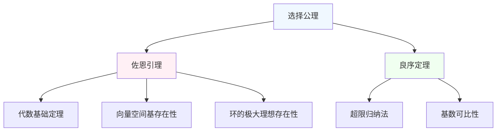

---
tags:
  - 数学基础
  - 集合论
  - 选择公理
  - 佐恩引理
课程: 数学分析/实分析/数学基础
---

# 佐恩引理 (Zorn's Lemma) 笔记
## 定义
### 1.1 基本定义

设 $(P, \leq)$ 是一个**偏序集**。如果 $P$ 中的每个**全序子集**（链）在 $P$ 中都有**上界**，那么 $P$ 至少有一个**极大元**。

### 1.2 相关概念解析

#### 偏序集 (Partially Ordered Set)
集合 $P$ 配上一个二元关系 $\leq$，满足：
- **自反性**：$\forall a \in P, a \leq a$
- **反对称性**：若 $a \leq b$ 且 $b \leq a$，则 $a = b$
- **传递性**：若 $a \leq b$ 且 $b \leq c$，则 $a \leq c$

#### 全序子集/链 (Chain)
$P$ 的子集 $C$，如果 $C$ 中任意两个元素都可比较，即：
$$\forall x, y \in C, x \leq y \ \text{或} \ y \leq x$$

#### 上界 (Upper Bound)
对于子集 $C \subseteq P$，元素 $u \in P$ 称为 $C$ 的上界，如果：
$$\forall c \in C, c \leq u$$

#### 极大元 (Maximal Element)
元素 $m \in P$ 称为极大元，如果：
$$\forall x \in P, m \leq x \ \Rightarrow \ m = x$$

## 与选择公理的等价性

佐恩引理与**选择公理**、**良序定理**在 **ZF** 公理系统下是**等价**的。

### 证明思路（佐恩引理 ⇒ 选择公理）
1. 给定非空集合族 $\{A_i\}_{i \in I}$，考虑所有**部分选择函数**的集合 $P$
2. 在 $P$ 上定义偏序：$f \leq g$ 当且仅当 $g$ 是 $f$ 的扩张
3. 验证 $P$ 满足佐恩引理的条件
4. $P$ 的极大元即为所需的选择函数

## 3 典型应用

### 向量空间基的存在性
**定理**：任意向量空间都有基

**证明**：
1. 考虑所有线性无关子集构成的集合 $P$，按包含关系排序
2. 每个链的并集是该链的上界
3. 由佐恩引理，存在极大线性无关子集
4. 这个极大子集就是向量空间的基

### 环的极大理想存在性
**定理**：含幺环必有极大理想

**证明思路**：
1. 考虑所有真理想的集合，按包含关系排序
2. 验证链条件满足
3. 应用佐恩引理得极大理想

## 4.1 理解要点

### 非构造性
与选择公理一样，佐恩引理只断言极大元的**存在性**，不提供具体的构造方法。

### 应用条件
使用佐恩引理时，必须验证两个条件：
1. 偏序集的每个链都有上界
2. 该上界必须在原偏序集中

---

**总结**：佐恩引理是处理"极大存在性"问题的强大工具，在代数学、泛函分析等领域有广泛应用，是现代数学的基础工具之一。