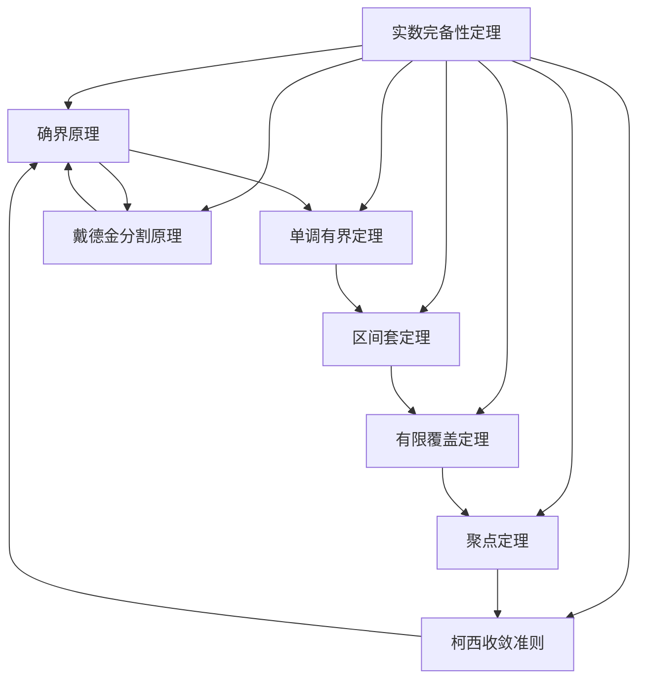
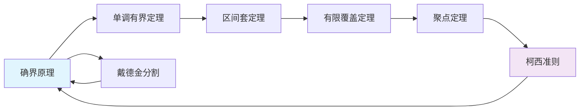

# 实数完备性七大定理的详细证明

## 一、确界原理 ⇒ 单调有界定理

**定理**：单调递增且有上界的数列必收敛。

**证明**：
1. 设数列 $\{x_n\}$ 单调递增且有上界，即 $x_1 \leq x_2 \leq \cdots \leq x_n \leq \cdots$ 且存在 $M$ 使得 $x_n \leq M$ 对所有 $n$ 成立
2. 考虑集合 $S = \{x_n \mid n \in \mathbb{N}\}$，由确界原理，$S$ 有上确界，记作 $\alpha = \sup S$
3. 由上确界定义：
   - $\alpha$ 是 $S$ 的上界：$x_n \leq \alpha$ 对所有 $n$ 成立
   - 对任意 $\varepsilon > 0$，存在 $x_N \in S$ 使得 $x_N > \alpha - \varepsilon$
4. 由于数列单调递增，当 $n \geq N$ 时：
   $$\alpha - \varepsilon < x_N \leq x_n \leq \alpha < \alpha + \varepsilon$$
5. 因此 $|x_n - \alpha| < \varepsilon$ 对所有 $n \geq N$ 成立
6. 故 $\lim_{n \to \infty} x_n = \alpha$

单调递减且有下界的情况证明类似。 ∎

## 二、单调有界定理 ⇒ 闭区间套定理

**定理**：设 $\{[a_n, b_n]\}$ 是一列闭区间，满足：
1. $[a_{n+1}, b_{n+1}] \subseteq [a_n, b_n]$（区间套叠）
2. $\lim_{n \to \infty} (b_n - a_n) = 0$（区间长度趋于零）
则存在唯一实数 $c$ 属于所有闭区间。

**证明**：
1. 由区间套条件，$\{a_n\}$ 单调递增且有上界（如 $b_1$），$\{b_n\}$ 单调递减且有下界（如 $a_1$）
2. 由单调有界定理：
   $$\lim_{n \to \infty} a_n = \alpha, \quad \lim_{n \to \infty} b_n = \beta$$
3. 由条件 (2)：$\lim_{n \to \infty} (b_n - a_n) = \beta - \alpha = 0$，故 $\alpha = \beta$
4. 对任意 $n$，有 $a_n \leq \alpha \leq b_n$，即 $\alpha \in [a_n, b_n]$
5. 唯一性：若存在 $c \neq \alpha$ 也属于所有区间，则 $|c - \alpha| \leq b_n - a_n \to 0$，矛盾 ∎

## 三、闭区间套定理 ⇒ 有限覆盖定理

**定理**：闭区间 $[a, b]$ 的任意开覆盖都有有限子覆盖。

**证明**（反证法）：
1. 假设 $[a, b]$ 不能被开覆盖 $\mathcal{U}$ 的任意有限子集覆盖
2. 将 $[a, b]$ 二等分，则至少有一个子区间不能被有限覆盖，记为 $[a_1, b_1]$
3. 重复此过程，得到闭区间套 $\{[a_n, b_n]\}$ 满足：
   - $[a_n, b_n] \subseteq [a_{n-1}, b_{n-1}]$
   - $b_n - a_n = \frac{b-a}{2^n} \to 0$
   - 每个 $[a_n, b_n]$ 都不能被 $\mathcal{U}$ 有限覆盖
4. 由闭区间套定理，存在唯一 $c \in \bigcap_{n=1}^{\infty} [a_n, b_n]$
5. 由于 $\mathcal{U}$ 是开覆盖，存在开集 $U \in \mathcal{U}$ 使得 $c \in U$
6. 由开集性质，存在 $\varepsilon > 0$ 使得 $(c-\varepsilon, c+\varepsilon) \subseteq U$
7. 当 $n$ 足够大时，$[a_n, b_n] \subseteq (c-\varepsilon, c+\varepsilon) \subseteq U$
8. 这与"$[a_n, b_n]$ 不能被有限覆盖"矛盾 ∎

## 四、有限覆盖定理 ⇒ 聚点定理

**定理**：有界无限点集必有聚点。

**证明**（反证法）：
1. 设 $E$ 是有界无限点集，假设 $E$ 没有聚点
2. 则对任意 $x \in [a, b]$（$E$ 所在区间），存在邻域 $U_x$ 只包含 $E$ 的有限个点
3. $\{U_x\}_{x \in [a,b]}$ 构成 $[a, b]$ 的开覆盖
4. 由有限覆盖定理，存在有限子覆盖 $U_{x_1}, \ldots, U_{x_n}$
5. 每个 $U_{x_i}$ 只包含 $E$ 的有限个点，因此 $E$ 是有限集，矛盾 ∎

## 五、聚点定理 ⇒ 柯西收敛准则

**定理**：数列收敛当且仅当它是柯西列。

**证明**：
**必要性**：若 $\lim_{n \to \infty} x_n = a$，则对任意 $\varepsilon > 0$，存在 $N$ 使得当 $n > N$ 时 $|x_n - a| < \varepsilon/2$。于是当 $m, n > N$ 时：
$$|x_m - x_n| \leq |x_m - a| + |a - x_n| < \varepsilon$$

**充分性**：
1. 设 $\{x_n\}$ 是柯西列，则它有界（存在 $N$ 使得 $|x_n - x_N| < 1$ 对 $n > N$）
2. 若 $\{x_n\}$ 只有有限多项，显然收敛
3. 若 $\{x_n\}$ 有无限多项，由聚点定理，存在聚点 $a$
4. 对任意 $\varepsilon > 0$：
   - 由柯西条件，存在 $N_1$ 使得当 $m, n > N_1$ 时 $|x_m - x_n| < \varepsilon/2$
   - 由聚点定义，存在 $n_0 > N_1$ 使得 $|x_{n_0} - a| < \varepsilon/2$
5. 于是当 $n > N_1$ 时：
   $$|x_n - a| \leq |x_n - x_{n_0}| + |x_{n_0} - a| < \varepsilon$$
6. 故 $\lim_{n \to \infty} x_n = a$ ∎

## 六、柯西收敛准则 ⇒ 确界原理

**定理**：有上界的非空实数集必有上确界。

**证明**：
1. 设 $S$ 是非空有上界集合，取 $a_1 \in S$，$b_1$ 为 $S$ 的一个上界
2. 构造区间套：令 $c_n = \frac{a_n + b_n}{2}$
   - 若 $c_n$ 是 $S$ 的上界，则令 $a_{n+1} = a_n$, $b_{n+1} = c_n$
   - 否则令 $a_{n+1} = c_n$, $b_{n+1} = b_n$
3. 易验证 $\{a_n\}$ 单调递增，$\{b_n\}$ 单调递减，且 $b_n - a_n = \frac{b_1 - a_1}{2^{n-1}} \to 0$
4. 由柯西准则，$\{a_n\}$ 和 $\{b_n\}$ 都收敛于同一极限 $\alpha$
5. 证明 $\alpha$ 就是 $S$ 的上确界：
   - $\alpha$ 是上界：若存在 $x \in S$ 使 $x > \alpha$，则当 $b_n < x$ 时矛盾
   - $\alpha$ 是最小上界：对任意 $\varepsilon > 0$，存在 $a_n > \alpha - \varepsilon$ 且 $a_n \in S$ ∎

## 七、完备性定理的等价性总结

上述证明完成了实数完备性七大定理的循环推导，证明了它们的等价性

