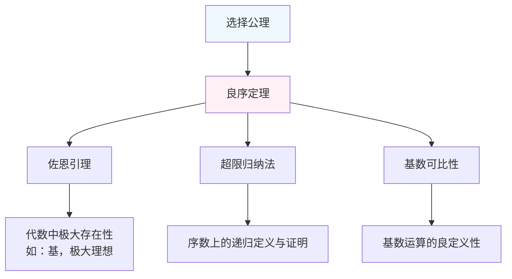

---
tags:
  - 数学基础
  - 集合论
  - 选择公理
  - 良序定理
课程: 数学分析/实分析/数学基础
---

#  良序定理 (Well-Ordering Theorem)

## 1. 定理陈述

### 1.1 基本定义
设 \( S \) 是一个集合，则存在 \( S \) 上的一个**良序**关系 \( \prec \)，即 \( (S, \prec) \) 构成一个良序集。

**良序集**：一个全序集 \( (S, \prec) \) 称为良序集，当且仅当 \( S \) 的**每一个**非空子集都有**最小元**。
数学表述：\( \forall A \subseteq S, A \neq \emptyset, \exists m \in A, \forall a \in A, m \preceq a \)。

### 1.2 核心内涵
无论集合 \( S \) 的基数多大、结构多复杂（例如实数集 \( \mathbb{R} \)），都**存在**一种方式将其排列成一个“良序”，使得其任意非空部分都有一个“首元素”。

## 2. 与选择公理的等价性

良序定理与**选择公理 (Axiom of Choice)** 在 **ZF** 公理系统下是**等价**的。

### 2.1 由选择公理证明良序定理（证明思路）

#### 目标
为集合 $S$ 构造一个良序 $\prec$。

#### 关键工具
应用**选择公理**。

#### 构造过程
1. 设 $\alpha$ 是一个大于 $|S|$ 的序数（由哈特格斯数保证存在）。
2. 使用选择公理，递归地为每个 $\beta < \alpha$ 指定元素 $f(\beta) \in S \setminus \{ f(\gamma) \mid \gamma < \beta \}$（如果该差集非空）。
3. 由于 $\alpha > |S|$，此过程必然在某个步骤耗尽 $S$ 的所有元素。
4. 这个递归过程在 $S$ 上诱导了一个序关系 $\prec$，它同构于一个序数，因此是良序。

### 2.2 由良序定理证明选择公理

#### 已知条件
非空集合族 $\mathcal{A} = \{A_i\}_{i \in I}$。

#### 证明步骤
1. **应用良序定理**：对并集 $\bigcup_{i \in I} A_i$ 施加一个良序 $\prec$。
2. **定义选择函数**：对于每个 $i \in I$，定义 $f(A_i)$ 为 $A_i$ 在该良序 $\prec$ 下的**最小元**。
3. **结论**：$f$ 即为所需的选择函数。
## 3. 重要推论与应用

### 3.1 超限归纳法 (Transfinite Induction)

良序定理确保了超限归纳法的有效性。设 $(S, \prec)$ 是良序集，$P(x)$ 是一个性质。如果满足：

1.  基础情形：$P(\min S)$ 成立。
2.  归纳步骤：若 $\forall y \prec x, P(y)$ 成立，则 $P(x)$ 成立。

那么，$P(x)$ 对所有 $x \in S$ 成立。

### 3.2 基数的良序性

良序定理蕴含了任何两个基数都是可比较的。这是建立基数算术理论的基石。
## 4

### 4.1 非构造性

良序定理是非构造性的。它只断言良序的存在性，但没有提供具体的构造方法。对于像实数集 $\mathbb{R}$ 这样的不可数集，我们无法明确写出其良序关系。

### 4.2 与直觉的差异

实数集在通常的序 $\leq$ 下不是良序的，但良序定理断言存在某种“反直觉”的序使其良序。这个良序与实数的拓扑、代数结构没有必然的相容性。

## 5. 知识结构图

---

**总结**：良序定理是选择公理的一个深刻等价形式，它将无限集合的“未结构化的存在”转化为“具有良序结构的对象”，从而为超限方法的应用铺平了道路，但其非构造性本质也引发了数学哲学上的持续讨论。